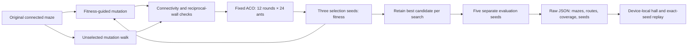

# Architecture

Maze cells store four wall booleans. A mutation opens one closed passage and closes one open passage; proposals that disconnect a cell are rejected. Up to 40 attempts are made before returning an unchanged parent. Start and goal stay in opposite grid corners. Dimensions and passage count stay fixed; shortest-path length can change.

Evolution proposes three mutations per generation and uses the incumbent winner as the parent. Random search walks through mutations without fitness-guided parenting and separately retains its highest-scoring candidate. It is a local mutation-walk baseline, not uniform sampling over all possible mazes. Both searches evaluate the same number of proposals with the same solver seeds and budget.

Fitness is failure rate plus 0.1 × successful mean capped route excess plus 0.05 × failed mean unexplored fraction. Route excess is capped at 2; successful route length is divided by BFS shortest moves. Coverage is the fraction of cells visited across all ants in a run. Coverage provides a search signal when all candidates fail; it is not itself proof of a meaningful new failure class.

The hall stores up to eight experiment records in local browser storage. A replay restores the saved maze, solver seed and fixed budget. When no ant reaches the goal, it displays the longest unsuccessful attempt with an explicit failure label. A* and standard ACO remain available in the workspace below; standard ACO uses a larger budget.
